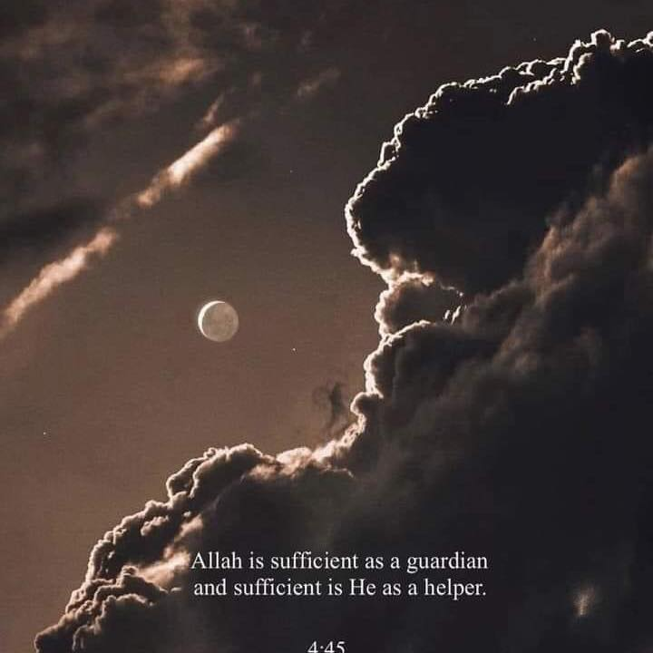

<!--markdown turorial-->
### Normal Text
Dipraaz Sareng  
Live in sundarban
</br>

## This is Horizontal rule
---
# sareng
## sareng
### sareng
#### sareng
##### sareng
###### sareng
</br>

### Paragraph
<p> hi, this is ruhit. i am 37. Live in morocco. I have just finished my prayer. </p>
</br>

### This is italic
<i> This is an italic text </i></br>
_This is an italic text_ 
</br>

### This is Bold

__This is bold__
</br>

### This is strikethrough

~~this is strikethrough~~
</br>

### Single line code

`This is inline`  
`<h1> This is in the line </h1>`
</br>

### Multiple line code

```
<html>
<head></head>
<body></body>
</html>
```

```html
<html>
<head></head>
<body></body>
</html>
```

```css
head{
    background-colour: green;
}
```

```javascript
console.log('hello')
```
</br>

### Order list java
<ol>
<li>Item 1</li>
<li>Item1</li>
</ol>

### Order list
1. item1
1. item1
   1. item1
   1. item11. item1
1. item1

### Unorder List
- list1
- list2
   - list1
   - list2
   - list3
- list3

### Task list
- [x] Task1
- [x] Task2
- [] Task3
</br>

### automatic link
http://www.worldwide.com

### disable link
`http://www.wordwide.com`

### markdown link syntax
[title](http://www.worldwide.com)

[stadywithsareng][websitelink]

[Facebook][facebooklink]  
[facebook](http://facebook.com)

### Image syntax
<!---->


### Emoji
😊
</br>

### Table
| Name | Email |
|-------|-------|
|Anis| anisulislam@gmail.com|
|sareng| sareng@yahoo.com|
|didar|didar@outloo.com|


<!-- all link is here -->
[websitelink]: http://www.stady.com

[facebooklink]: http://facebook.com

[gmaillink]: http://gmail.com
